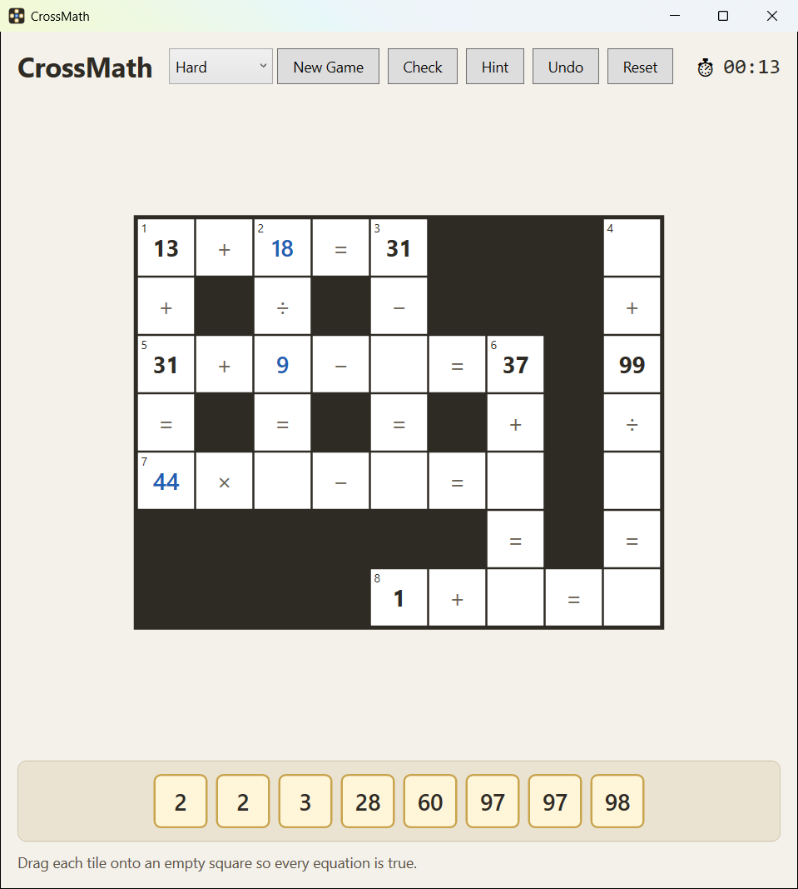

# CrossMath

A crossword-style math puzzle game for Windows, built with C# and WPF.

Every row and column in the grid is an equation. Drag the number tiles into the empty squares so that **every equation is true** — across and down at the same time.



## How to play

- **Drag** a tile from the pool onto an empty square. Drag between squares to swap tiles, or back to the pool to remove one.
- Or **click** a tile, then click a square. **Right-click** a placed tile to send it back to the pool.
- **Check** colors the squares of every completed equation green (correct) or red (wrong).
- **Hint** places one correct tile and locks it.
- **Reset** clears the board. **New Game** or a difficulty change generates a fresh puzzle.

### Rules

- Equations are evaluated **left to right**, with no operator precedence: `2 + 3 × 4 = 20`.
- Every step must stay a **whole, non-negative number**: division must be exact, and no intermediate result can go below zero.
- Every puzzle has **exactly one solution** using the tiles provided.

### Difficulty

| | Easy | Medium | Hard |
|---|---|---|---|
| Operators | + − | + − × | + − × ÷ |
| Numbers up to | 20 | 50 | 99 |
| Equations | 4 | 6 | 8–9 |
| Equation shapes | `a ○ b = c` | also `a ○ b ○ c = d` | also `a ○ b ○ c = d` |
| Squares hidden | ~40% | ~55% | ~65% |

## Running it

Requires Windows and the [.NET 10 SDK](https://dotnet.microsoft.com/download).

```sh
dotnet run --project src/CrossMath.App
```

Build a standalone, single-file `CrossMath.App.exe` (about 62 MB; runs on 64-bit Windows without .NET installed):

```sh
dotnet publish src/CrossMath.App -p:PublishProfile=SingleFile
```

It lands in `src/CrossMath.App/bin/publish/`. In Visual Studio, the same profile appears under **Publish** for the CrossMath.App project.

Run the tests:

```sh
dotnet test
```

## How it works

Puzzles are generated on the fly in four steps (see [`src/CrossMath.Core`](src/CrossMath.Core)):

1. **Layout** — equations are placed one at a time, each crossing an existing equation at a number square, with crossword rules so equations never touch side by side or end to end. Each step samples a few placements and keeps the most compact, so the grid interlocks like a crossword.
2. **Fill** — random operators are chosen, then a randomized backtracking search finds numbers that satisfy every equation. It rejects trivial-looking steps: `× 1`, `÷ 1`, and any `−` or `÷` that gives 0 or 1 (`x − x`, `x − (x − 1)`, `x ÷ x`).
3. **Hide** — number squares are hidden one by one. A solver counts how many ways the hidden tiles could be placed, and a square stays hidden only if the answer is still unique.
4. The hidden numbers become the tile pool.

Generation takes well under a second even on Hard.

## Project layout

```
src/CrossMath.Core/          Game engine: model, evaluator, layout, filler, solver, generator (no UI)
src/CrossMath.App/           WPF app (MVVM)
  ViewModels/                MainViewModel, CellViewModel, TileViewModel, TilePoolViewModel
  Views/                     MainWindow.xaml
  Behaviors/                 Attached drag-and-drop behaviors that call view-model commands
  Converters/                Value converters and the cell template selector
  Services/                  Timer abstraction
tests/CrossMath.Core.Tests/  Engine tests (evaluator, solver, generator over many seeds)
tests/CrossMath.App.Tests/   View-model tests with a fake generator and timer
```

The app follows MVVM strictly using [CommunityToolkit.Mvvm](https://learn.microsoft.com/dotnet/communitytoolkit/mvvm/): views only bind, view models don't reference WPF types, and services are injected through `Microsoft.Extensions.DependencyInjection`.
